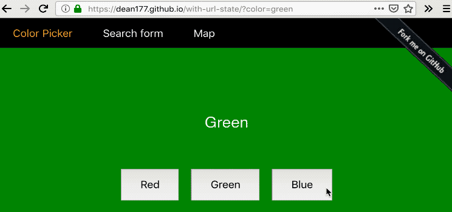

# with-url-state

[](https://circleci.com/gh/Dean177/with-url-state)
[](https://codecov.io/gh/Dean177/with-url-state)
[](https://www.npmjs.com/package/with-url-state)

Lifts the state out of a react component and into the url



## Installation

To install with npm use

`npm install with-url-state --save`

To install with yarn use

`yarn add with-url-state`

## Usage

Check out the the [demo](https://dean177.github.io/with-url-state/) view the [code](https://github.com/Dean177/with-url-state/tree/master/demo) or play with it in [CodeSandbox](https://codesandbox.io/s/18x4l87yx7). 

Using javascript

```javascript
import React from 'react'
import { useUrlState } from 'with-url-state'

export const UrlForm = () => {
  const [urlState, setUrlState] = useUrlState({ color: 'blue' })
  return (
    <div className="UrlForm">
      <div className="current-state" style={{ backgroundColor: props.urlState.color }}>
        <div>{urlState.color}</div>
      </div>
      <div className="color-buttons">
        <button className="Red" onClick={() => setUrlState({ color: 'red' })}>
          Red
        </button>
        <button className="Green" onClick={() => setUrlState({ color: 'green' })}>
          Green
        </button>
        <button className="Blue" onClick={() => setUrlState({ color: 'blue' })}>
          Blue
        </button>
      </div>
    </div>
  )
}
```

## TODO - FAQ's? Gotchas?

Url state must be represented as strings

no way to tell the if `?someParam=false` should be dematerialised to a boolean or to a string. See the following issue for more detail: 

You should validate the values you receive, they are user editable! 

## Alternative API's

Using the higher-order-component api

```javascript
import React from 'react'
import { withUrlState } from 'with-url-state'

const enhance = withUrlState(() => ({ color: 'blue' }))

export const UrlForm = enhance((props) => (
  <div className="UrlForm">
    <div className="current-state" style={{ backgroundColor: props.urlState.color }}>
      <div>{props.urlState.color}</div>
    </div>
    <div className="color-buttons">
      <button className="Red" onClick={() => props.setUrlState({ color: 'red' })}>
        Red
      </button>
      <button className="Green" onClick={() => props.setUrlState({ color: 'green' })}>
        Green
      </button>
      <button className="Blue" onClick={() => props.setUrlState({ color: 'blue' })}>
        Blue
      </button>
    </div>
  </div>
))
```

Using the render-prop component

```typescript jsx
import React from 'react'
import { UrlState } from 'with-url-state'

export const UrlForm = () => (
  <UrlState
    initialState={{ color: 'green' }}
    render={({ setUrlState, urlState }) => (
      <div className="UrlForm">
        <div className="current-state" style={{ backgroundColor: urlState.color }}>
          <div>{urlState.color}</div>
        </div>
        <div className="color-buttons">
          <button className="Red" onClick={() => setUrlState({ color: 'red' })}>
            Red
          </button>
          <button className="Green" onClick={() => setUrlState({ color: 'green' })}>
            Green
          </button>
          <button className="Blue" onClick={() => setUrlState({ color: 'blue' })}>
            Blue
          </button>
        </div>
      </div>
    )}
  />
)
```

## Motivation

`with-url-state` automates tiresome query parameter manipulations, simplifying components where the URL will be used for sharing, search results, querying data or tracking a visible portion of a map.
